<div align="center">

# 🧠 AI-Based Gait Analysis System for Parkinson's Disease

### *An Intelligent Clinical Decision Support Platform for Automated Gait Analysis Using Artificial Intelligence, Computer Vision, and Biomechanical Assessment*

---


---

### 🏥 AI-Powered Clinical Gait Assessment • Parkinson's Risk Prediction • Biomechanical Analysis • Intelligent Decision Support

</div>

---

# 📖 Project Overview

The **AI-Based Gait Analysis System for Parkinson's Disease** is a **Biomedical Engineering clinical decision-support platform** designed to automate gait assessment from uploaded walking videos using **Artificial Intelligence**, **Computer Vision**, and **Biomechanical Analysis**.

The system performs **markerless gait analysis**, extracting clinically significant gait parameters without requiring wearable sensors, motion capture suits, or specialized laboratory equipment. Using advanced pose estimation and biomechanical computations, it analyzes a patient's walking pattern and generates an objective clinical assessment.

Unlike conventional gait analysis systems that require expensive laboratory infrastructure, this project is designed as a **web-based, AI-assisted platform** capable of supporting clinicians, physiotherapists, researchers, and students by providing rapid, standardized, and reproducible gait evaluations.

Rather than relying on a single measurement, the platform combines multiple gait parameters to estimate:

- Parkinson's Disease Risk
- Overall Gait Health
- Functional Mobility
- Balance Performance
- Walking Symmetry
- Fall Risk
- Disease Severity Classification

The generated results are presented through a modern **hospital-style clinical dashboard**, offering both numerical values and interactive visualizations for easier interpretation.

---

# 🎯 Vision

To make **clinical gait assessment more accessible, objective, and affordable** by leveraging modern Artificial Intelligence and Computer Vision technologies, enabling earlier detection of gait abnormalities and supporting evidence-based rehabilitation.

---

# 🌍 Why This Project Matters

Parkinson's Disease is one of the fastest-growing neurological disorders worldwide and significantly affects mobility and independence.

Traditional gait analysis often requires:

- Motion capture laboratories
- Wearable sensors
- Force plates
- Infrared camera systems
- Specialized clinical equipment
- Highly trained technicians

These systems are:

- Expensive
- Time-consuming
- Difficult to access
- Limited to specialized hospitals

This project addresses these limitations by providing a web-based solution capable of analyzing ordinary walking videos captured using standard cameras.

---

# ❗ Problem Statement

Parkinson's Disease progressively impairs motor function, leading to abnormalities in gait such as:

- Reduced walking speed
- Shortened step length
- Decreased stride length
- Increased double support time
- Reduced arm swing
- Freezing episodes
- Poor balance
- Walking asymmetry
- Increased fall risk

Clinical gait assessment is a crucial component of neurological examination. However, quantitative gait analysis remains inaccessible in many healthcare settings due to the high cost and complexity of existing systems.

Current challenges include:

| Challenge | Clinical Impact |
|-----------|----------------|
| Expensive gait laboratories | Limited accessibility |
| Dependence on wearable sensors | Reduced patient comfort |
| Manual measurements | Observer variability |
| Subjective assessment | Reduced reproducibility |
| Limited quantitative analysis | Lower diagnostic confidence |
| Time-intensive workflows | Reduced clinical efficiency |

This project proposes an **AI-assisted markerless gait analysis system** capable of delivering standardized and clinically interpretable gait metrics from a simple uploaded walking video.

---

# 💡 Motivation

The motivation behind this project stems from the need to bridge the gap between advanced gait laboratories and everyday clinical practice.

Many hospitals, rehabilitation centers, rural clinics, and educational institutions lack access to sophisticated gait analysis systems due to financial and infrastructural constraints.

Recent advances in Artificial Intelligence and Computer Vision make it possible to estimate body landmarks accurately from ordinary RGB videos. This creates an opportunity to build affordable, scalable, and intelligent gait assessment tools that support clinicians without replacing clinical judgment.

By integrating AI with evidence-based gait analysis principles, this project aims to democratize access to quantitative movement assessment.

---

# 🎯 Project Objectives

The primary objectives of this project are:

## 1. Automated Gait Analysis

Develop a fully automated system capable of extracting clinically meaningful gait parameters from uploaded walking videos.

---

## 2. Markerless Motion Analysis

Eliminate the need for wearable sensors and expensive motion capture equipment by using computer vision–based pose estimation.

---

## 3. Clinical Decision Support

Provide clinicians with an AI-assisted interpretation of gait characteristics rather than raw numerical measurements alone.

---

## 4. Early Parkinson's Risk Assessment

Estimate the likelihood of Parkinsonian gait patterns through multi-parameter biomechanical analysis.

---

## 5. Standardized Clinical Evaluation

Compare measured gait parameters against internationally recognized healthy adult reference values to support objective clinical assessment.

---

## 6. Interactive Clinical Reporting

Present findings using intuitive dashboards, graphs, and downloadable reports suitable for documentation and discussion.

---

## 7. Research and Educational Utility

Create a platform that can be used for:

- Biomedical Engineering projects
- Academic research
- Clinical demonstrations
- Student learning
- Algorithm evaluation
- Rehabilitation studies

---

# 🚀 Core Innovations

This project introduces several notable capabilities:

- ✅ AI-powered markerless gait analysis
- ✅ Multi-parameter biomechanical assessment
- ✅ Intelligent clinical comparison engine
- ✅ Hidden AI processing with user-friendly progress tracking
- ✅ Hospital-style clinical dashboard
- ✅ Parkinson's Disease risk estimation
- ✅ Disease severity classification
- ✅ Interactive clinical visualizations
- ✅ Multi-format report export (PDF, PNG, CSV, JSON)
- ✅ Responsive web application with Dark and Light themes
- ✅ Multi-angle gait analysis support

---

# 🏗️ High-Level System Overview

```text
Walking Video
      │
      ▼
Upload Interface
      │
      ▼
AI Processing Engine
      │
      ▼
Computer Vision
      │
      ▼
Pose Landmark Detection
      │
      ▼
Biomechanical Feature Extraction
      │
      ▼
Clinical Parameter Calculation
      │
      ▼
AI Decision Engine
      │
      ▼
Clinical Dashboard
      │
      ▼
Exportable Clinical Report
```

---

# 📑 Table of Contents

- Project Overview
- Problem Statement
- Motivation
- Objectives
- Core Innovations
- Key Features
- Complete System Workflow
- Supported Analysis Modes
- Website Architecture
- AI Processing Pipeline
- Computer Vision Pipeline
- Clinical Decision Support System
- Clinical Dashboard
- WHO & International Reference Standards
- Gait Parameters
- Parkinson's Risk Prediction
- Disease Severity Classification
- AI Clinical Summary
- Interactive Charts
- Technology Stack
- Folder Structure
- Installation Guide
- Usage Instructions
- API Structure
- Sample Clinical Report
- Performance Metrics
- Research Applications
- Clinical Applications
- Future Scope
- References
- License
- Author

---

# ✨ Key Features

The **AI-Based Gait Analysis System for Parkinson's Disease** is designed as a **research-grade, AI-assisted clinical decision support platform** that combines Computer Vision, Artificial Intelligence, and Biomechanical Analysis to deliver objective gait assessment from uploaded walking videos.

Unlike traditional gait analysis systems that require wearable sensors or motion capture laboratories, this platform performs **markerless gait analysis** using standard RGB videos, making quantitative gait assessment more accessible and scalable.

---

## 🚀 Core Functionalities

### 🎥 AI-Based Video Analysis

- Upload walking videos through a secure web interface.
- Supports high-quality video formats (MP4, MOV, AVI, WEBM).
- Automated preprocessing before AI analysis.
- No wearable sensors or markers required.
- Fully automated workflow from upload to clinical report.

---

### 🦵 Markerless Gait Analysis

The system uses **computer vision-based pose estimation** to detect and track human body landmarks frame-by-frame.

Capabilities include:

- Full-body pose tracking
- Joint coordinate estimation
- Temporal gait analysis
- Limb movement tracking
- Walking trajectory estimation
- Body alignment monitoring

---

### 🤖 Hidden AI Processing

To provide a clean clinical experience, the platform performs all AI computations in the background.

Users are presented only with:

- 📤 Upload Progress
- ⚙️ Analysis Progress
- 📊 Result Generation
- ✅ Clinical Dashboard

The following processes remain hidden:

- Video decoding
- Frame extraction
- Landmark detection
- Noise filtering
- Pose estimation
- Gait cycle segmentation
- Biomechanical calculations
- Clinical comparison
- Risk prediction
- Report generation

---

### 🏥 Intelligent Clinical Assessment

Instead of evaluating a single parameter, the system integrates multiple gait characteristics to generate a clinically meaningful assessment.

The decision engine considers:

- Walking Speed
- Cadence
- Step Length
- Stride Length
- Step Width
- Stance Phase
- Swing Phase
- Double Support Time
- Single Support Time
- Walking Symmetry
- Arm Swing Symmetry
- Gait Stability
- Turning Performance
- Timed Up and Go (TUG)

This multi-parameter approach better reflects real clinical practice than fixed threshold-based methods.

---

# 🌟 Complete Feature List

| Feature | Description |
|----------|-------------|
| 🎥 Video Upload | Upload walking videos for analysis |
| 🤖 AI Processing | Fully automated gait analysis |
| 🦴 Pose Estimation | Markerless human pose detection |
| 📏 Gait Parameter Extraction | Automatic biomechanical measurements |
| 🧠 AI Clinical Decision Engine | Multi-parameter clinical assessment |
| 📊 Clinical Dashboard | Interactive visualization of results |
| 📈 Charts & Graphs | Radar, Pie, Bar, Line, Trend, Gauge |
| 🏥 Clinical Reference Comparison | Healthy adult reference comparison |
| ⚠️ Parkinson's Risk Prediction | AI-assisted risk estimation |
| 📉 Disease Severity Classification | Severity categorization |
| 📄 Report Generation | Export PDF, PNG, CSV, JSON |
| 🌙 Dark Mode | Professional clinical interface |
| ☀️ Light Mode | Accessible alternative theme |
| 📱 Mobile Responsive | Works across devices |

---

# 🔄 Complete System Workflow

The complete workflow is designed to be simple for end users while performing sophisticated analysis internally.

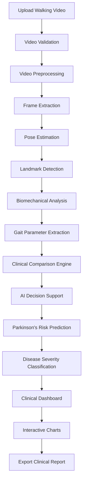

---

# 🧠 Hidden AI Processing Pipeline

Although users only observe progress indicators, the backend performs several computational stages.

```text
Uploaded Video
      │
      ▼
Video Validation
      │
      ▼
Frame Sampling
      │
      ▼
Image Enhancement
      │
      ▼
Pose Landmark Detection
      │
      ▼
Joint Coordinate Tracking
      │
      ▼
Temporal Motion Analysis
      │
      ▼
Gait Cycle Segmentation
      │
      ▼
Biomechanical Computation
      │
      ▼
Clinical Parameter Calculation
      │
      ▼
Reference Comparison
      │
      ▼
AI Clinical Inference
      │
      ▼
Dashboard Generation
```

---

# 📋 User Workflow

From the user's perspective, the application remains straightforward and intuitive.

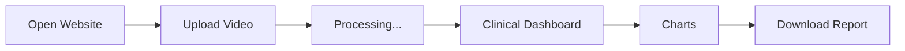

---

# 🔬 AI Processing Stages

The AI engine follows a structured processing pipeline:

## Stage 1 — Video Acquisition

The uploaded walking video is validated for:

- Supported format
- Frame rate
- Resolution
- File integrity
- Video duration

Invalid or corrupted files are rejected before analysis begins.

---

## Stage 2 — Video Preprocessing

Preprocessing improves analysis quality by:

- Normalizing frame dimensions
- Stabilizing minor camera motion
- Reducing image noise
- Adjusting brightness and contrast (when required)
- Preparing frames for pose estimation

---

## Stage 3 — Pose Landmark Detection

The AI detects anatomical landmarks including:

- Head
- Neck
- Shoulders
- Elbows
- Wrists
- Spine
- Hips
- Knees
- Ankles
- Heels
- Toes

These landmarks form the basis for biomechanical analysis.

---

## Stage 4 — Motion Tracking

Landmarks are tracked across consecutive frames to estimate:

- Joint trajectories
- Walking velocity
- Limb coordination
- Step transitions
- Swing dynamics
- Balance characteristics

---

## Stage 5 — Gait Cycle Segmentation

The walking sequence is divided into complete gait cycles.

Each gait cycle contains:

- Heel Strike
- Loading Response
- Mid Stance
- Terminal Stance
- Pre Swing
- Initial Swing
- Mid Swing
- Terminal Swing

---

## Stage 6 — Biomechanical Measurements

The system calculates multiple quantitative parameters including:

- Spatial parameters
- Temporal parameters
- Symmetry indices
- Stability metrics
- Functional mobility measures

---

## Stage 7 — Clinical Decision Support

All computed metrics are evaluated collectively using an intelligent rule-based and AI-assisted inference engine.

The system generates:

- Overall gait health score
- Parkinson's risk score
- Fall risk estimation
- Balance assessment
- Clinical interpretation

---

# 🏃 Supported Analysis Modes

The platform supports multiple standardized gait assessment scenarios commonly used in clinical and rehabilitation settings.

| Analysis Mode | Description |
|---------------|-------------|
| 🚶 Normal Walking Test | Standard forward walking assessment |
| ⏱️ Timed Up and Go (TUG) | Functional mobility evaluation |
| ↔️ Side View Analysis | Sagittal plane gait analysis |
| ↕️ Front View Analysis | Frontal plane symmetry analysis |
| 🔄 Multi-Angle Analysis | Combined view assessment |
| 🚶 Continuous Walk Analysis | Long-distance walking evaluation |
| 👨‍⚕️ Clinical Assessment Mode | Comprehensive gait examination |
| 📚 Research Mode | Detailed parameter extraction for research |

---

# 🏥 Clinical Use Cases

The platform is designed to support a wide range of clinical and academic applications.

## Neurology

- Parkinson's Disease screening
- Movement disorder assessment
- Motor impairment monitoring

---

## Physiotherapy

- Rehabilitation progress tracking
- Functional mobility evaluation
- Balance assessment

---

## Orthopedics

- Post-operative gait evaluation
- Lower limb biomechanics
- Recovery monitoring

---

## Biomedical Engineering

- AI algorithm development
- Computer vision research
- Gait dataset validation
- Clinical technology demonstration

---

## Academic Institutions

Suitable for:

- Final-year biomedical engineering projects
- AI healthcare research
- Computer vision coursework
- Clinical engineering education

---

# 📊 Expected Output

Upon completion of analysis, the system generates:

- ✅ Clinical gait assessment dashboard
- ✅ Comprehensive gait parameters
- ✅ AI-generated clinical summary
- ✅ Parkinson's risk estimation
- ✅ Disease severity classification
- ✅ Fall risk assessment
- ✅ Balance score
- ✅ Interactive visualizations
- ✅ Downloadable clinical reports

---

# 🏗️ Website & System Architecture

The **AI-Based Gait Analysis System for Parkinson's Disease** is designed using a modular, scalable, and maintainable architecture. The system separates the presentation layer, AI processing engine, clinical decision support engine, and reporting modules, allowing independent development and future integration with hospital information systems (HIS) and electronic health records (EHR).

The architecture follows a layered approach to ensure:

- 🔒 Secure data handling
- ⚡ Efficient AI processing
- 📈 Scalable deployment
- 🏥 Clinical-grade presentation
- 🧩 Modular component integration
- 🌐 Cross-platform accessibility

---

# 🌐 High-Level Website Architecture

```mermaid
flowchart LR

A[👤 User]

A --> B[Responsive Web Interface]

B --> C[Flask Backend]

C --> D[Video Processing Engine]

D --> E[AI & Computer Vision Engine]

E --> F[Biomechanical Analysis]

F --> G[Clinical Decision Engine]

G --> H[Clinical Dashboard]

H --> I[Interactive Charts]

I --> J[Clinical Report Generator]

J --> K[PDF / PNG / CSV / JSON]

```

---

# 🧩 System Architecture

```text
                    User
                     │
                     ▼
        Responsive Web Application
                     │
                     ▼
        Flask Application Server
                     │
     ┌───────────────┼────────────────┐
     ▼               ▼                ▼
Video Module   AI Processing     Report Module
     │               │                │
     ▼               ▼                ▼
Pose Detection  Biomechanics   PDF / CSV Export
     │               │
     ▼               ▼
Clinical Decision Engine
     │
     ▼
Clinical Dashboard
```

---

# ⚙️ Software Architecture

The application is divided into multiple functional modules to improve readability, testing, and scalability.

| Module | Purpose |
|---------|---------|
| Frontend | User interface and visualization |
| Backend | Handles API requests and workflow |
| AI Engine | Pose estimation and inference |
| CV Engine | Landmark extraction and tracking |
| Biomechanics Engine | Gait parameter computation |
| Clinical Engine | Risk prediction and scoring |
| Visualization Engine | Graphs and dashboard |
| Report Engine | Export reports in multiple formats |

---

# 💻 Frontend Architecture

The frontend is designed to provide a **hospital-style clinical experience**, emphasizing clarity, accessibility, and responsive design.

## Primary Components

```
Home Page
│
├── Hero Section
├── About Project
├── Upload Interface
├── Analysis Progress
├── Results Dashboard
├── Interactive Charts
├── Report Download
├── Theme Switcher
└── Footer
```

---

## 🎨 User Interface Features

- Responsive design
- Mobile-friendly layout
- Professional medical color palette
- Dark mode
- Light mode
- Animated upload progress
- Real-time processing indicators
- Interactive parameter cards
- Clinical report viewer

---

# ⚡ Backend Architecture

The backend coordinates all computational workflows and serves as the bridge between the user interface and the AI engine.

Responsibilities include:

- Receiving uploaded videos
- Input validation
- Video preprocessing
- AI pipeline execution
- Clinical analysis
- Dashboard generation
- Report generation
- API responses

---

## Backend Workflow

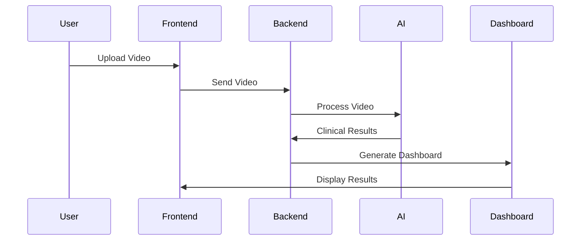

---

# 📂 Suggested Project Folder Structure

```text
AI-Based-Gait-Analysis-System/
│
├── app.py
├── requirements.txt
├── README.md
├── LICENSE
│
├── static/
│   ├── css/
│   ├── js/
│   ├── images/
│   ├── icons/
│   └── uploads/
│
├── templates/
│   ├── index.html
│   ├── dashboard.html
│   ├── report.html
│   └── components/
│
├── models/
│   ├── pose_model.py
│   ├── gait_analysis.py
│   ├── clinical_engine.py
│   ├── prediction.py
│   └── severity_classifier.py
│
├── services/
│   ├── video_processor.py
│   ├── landmark_detector.py
│   ├── biomechanics.py
│   ├── gait_cycles.py
│   └── report_generator.py
│
├── utils/
│   ├── helpers.py
│   ├── validators.py
│   ├── constants.py
│   └── calculations.py
│
├── exports/
│   ├── pdf/
│   ├── csv/
│   ├── json/
│   └── png/
│
├── datasets/
│
├── docs/
│
└── tests/

```

---

# 🔐 Security Considerations

The application incorporates several security measures to ensure reliable and safe handling of uploaded clinical data.

### File Validation

- File extension verification
- MIME type validation
- Maximum upload size restriction
- Invalid file rejection

---

### Processing Safety

- Temporary storage during analysis
- Automatic cleanup of processed files
- Exception handling
- Error logging

---

### Privacy

- Local processing capability
- No unnecessary storage of uploaded videos
- Report generation without exposing raw video
- Suitable foundation for future HIPAA/GDPR-compliant deployments

> **Note:** The current implementation is intended for educational and research use. Clinical deployment would require additional regulatory compliance, security auditing, and validation.

---

# 📡 Data Flow Architecture

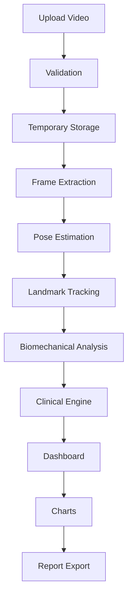

---

# 📦 Data Processing Pipeline

The application transforms raw video data into clinically meaningful insights through multiple processing layers.

| Stage | Input | Output |
|--------|-------|--------|
| Video Upload | Walking video | Validated media |
| Frame Extraction | Video | Individual frames |
| Pose Detection | Frames | Human landmarks |
| Landmark Tracking | Landmarks | Motion trajectories |
| Biomechanical Analysis | Trajectories | Gait parameters |
| Clinical Engine | Gait parameters | Risk scores |
| Visualization | Clinical results | Dashboard & graphs |
| Reporting | Dashboard | PDF, PNG, CSV, JSON |

---

# 🎯 Scalability

The modular architecture allows future enhancements without redesigning the system.

Potential upgrades include:

- ☁️ Cloud deployment
- 🏥 Hospital Information System (HIS) integration
- 📄 Electronic Health Record (EHR) integration
- 📱 Native Android and iOS applications
- ⌚ Wearable sensor fusion
- 🎥 Multi-camera synchronized gait analysis
- 🤖 Deep learning-based disease classification
- 📊 Population-level analytics
- 🌍 Multi-language support
- 🔗 RESTful API for third-party integration

---

# 🔄 Deployment Architecture

```text
                     Internet
                         │
                         ▼
                Web Browser / Mobile
                         │
                         ▼
                  Flask Web Server
                         │
      ┌──────────────────┼──────────────────┐
      ▼                  ▼                  ▼
 Video Engine      AI Processing      Report Engine
      │                  │                  │
      └──────────────┬───┴──────────────────┘
                     ▼
            Clinical Decision Engine
                     │
                     ▼
            Interactive Dashboard
                     │
                     ▼
          PDF • PNG • CSV • JSON Reports
```

---

# 🏥 Design Philosophy

The system has been developed with the following engineering principles:

- **Accuracy:** Prioritize clinically meaningful gait measurements.
- **Usability:** Provide an intuitive interface for clinicians and researchers.
- **Scalability:** Support future AI models and deployment environments.
- **Maintainability:** Use a modular architecture with clear separation of concerns.
- **Accessibility:** Reduce the need for specialized gait laboratories through markerless video analysis.
- **Transparency:** Present interpretable metrics and visualizations instead of opaque AI outputs.

---

# 🤖 Artificial Intelligence Pipeline

The **AI-Based Gait Analysis System for Parkinson's Disease** is powered by an intelligent multi-stage AI pipeline that transforms a standard walking video into clinically interpretable gait metrics.

Unlike conventional gait laboratories that rely on wearable sensors or marker-based motion capture systems, this platform uses **markerless computer vision** to estimate body posture, track movement over time, and compute biomechanical gait parameters.

The AI pipeline has been designed to prioritize:

- 🎯 High-precision landmark detection
- ⚡ Efficient processing
- 📊 Quantitative gait assessment
- 🏥 Clinical interpretability
- 🔬 Research reproducibility
- 📈 Scalable deployment

---

# 🧠 End-to-End AI Workflow

```mermaid
flowchart LR

A[Walking Video]

A --> B[Video Preprocessing]

B --> C[Frame Extraction]

C --> D[Pose Estimation]

D --> E[Landmark Detection]

E --> F[Motion Tracking]

F --> G[Gait Cycle Segmentation]

G --> H[Biomechanical Analysis]

H --> I[Feature Engineering]

I --> J[Clinical Decision Engine]

J --> K[Risk Prediction]

K --> L[Clinical Dashboard]

```

---

# 🎥 Stage 1 – Video Acquisition

The AI pipeline begins with a walking video uploaded through the web interface.

### Supported Formats

- MP4
- MOV
- AVI
- WEBM

### Recommended Recording Conditions

| Parameter | Recommendation |
|------------|----------------|
| Resolution | 1080p or higher |
| Frame Rate | 30 FPS or above |
| Lighting | Uniform illumination |
| Camera | Fixed position |
| Background | Plain, clutter-free |
| Subject | Entire body visible |

---

# 🛠️ Stage 2 – Video Preprocessing

Before AI inference begins, the uploaded video undergoes preprocessing to improve robustness and consistency.

### Preprocessing Steps

- Video decoding
- Frame extraction
- Resolution normalization
- Brightness adjustment
- Contrast enhancement
- Noise reduction
- Frame synchronization
- Orientation correction

These operations improve landmark detection accuracy while reducing the impact of environmental variations.

---

# 🧍 Stage 3 – Human Pose Estimation

The core of the AI system is **markerless human pose estimation**, which identifies anatomical landmarks for each frame.

The project utilizes **MediaPipe Pose** for high-speed, real-time landmark estimation.

### Key Advantages

- Markerless tracking
- Real-time performance
- Robust body landmark detection
- Cross-platform compatibility
- Suitable for clinical gait analysis

---

# 📍 Detected Anatomical Landmarks

The AI estimates the spatial coordinates of multiple body landmarks.

| Upper Body | Lower Body |
|-------------|------------|
| Nose | Hip |
| Eyes | Knee |
| Ears | Ankle |
| Shoulders | Heel |
| Elbows | Foot Index |
| Wrists | Toes |

Each landmark is represented by:

- X-coordinate
- Y-coordinate
- Z-coordinate (relative depth)
- Detection confidence score

---

# 🦴 Skeletal Representation

```text
        Head
         │
    Shoulders
      /     \
   Elbow   Elbow
      \     /
      Wrist Wrist
         │
       Spine
         │
       Pelvis
      /      \
    Hip      Hip
     │        │
   Knee     Knee
     │        │
   Ankle   Ankle
     │        │
 Heel      Heel
     │        │
 Toes      Toes
```

---

# 🎯 Stage 4 – Landmark Tracking

Once landmarks are detected, they are tracked across consecutive video frames to reconstruct continuous movement trajectories.

The tracking process enables:

- Walking trajectory estimation
- Joint displacement analysis
- Limb synchronization
- Temporal gait assessment
- Motion consistency evaluation

---

# 🔄 Temporal Motion Analysis

For every detected landmark, the system calculates:

- Position over time
- Velocity
- Acceleration
- Angular displacement
- Movement frequency

These temporal characteristics form the basis of gait parameter computation.

---

# 🚶 Stage 5 – Gait Cycle Detection

The AI automatically identifies complete gait cycles by detecting characteristic foot contact events.

### Typical Gait Cycle Phases

```text
Heel Strike

↓

Loading Response

↓

Mid Stance

↓

Terminal Stance

↓

Pre Swing

↓

Initial Swing

↓

Mid Swing

↓

Terminal Swing

↓

Heel Strike
```

Each detected gait cycle is analyzed independently before aggregating results across the entire walking sequence.

---

# 📐 Stage 6 – Biomechanical Feature Extraction

The extracted landmark trajectories are transformed into quantitative biomechanical measurements.

### Spatial Features

- Step Length
- Stride Length
- Step Width
- Walking Path
- Foot Placement
- Symmetry

---

### Temporal Features

- Cadence
- Step Time
- Stride Time
- Swing Time
- Stance Time
- Double Support Time
- Single Support Time
- Gait Cycle Duration

---

### Kinematic Features

- Hip motion
- Knee motion
- Ankle motion
- Arm swing
- Trunk movement
- Turning behavior

---

# 📊 Feature Engineering

The system derives higher-level clinical indicators from the extracted biomechanical measurements.

Examples include:

- Walking Symmetry Index
- Gait Stability Index
- Overall Gait Health Score
- Balance Score
- Parkinson's Risk Score
- Fall Risk Score

These composite metrics provide a more comprehensive representation of gait performance than individual parameters alone.

---

# 🧮 AI Processing Pipeline

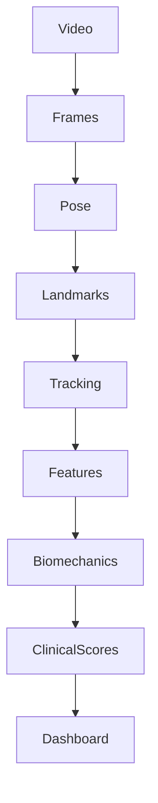

---

# 🧪 Noise Reduction & Signal Processing

To improve measurement reliability, the system applies filtering techniques during analysis.

Examples include:

- Landmark smoothing
- Outlier removal
- Temporal averaging
- Missing point interpolation
- Motion consistency checks

These processes reduce fluctuations caused by:

- Minor camera vibration
- Temporary landmark loss
- Occlusions
- Detection noise

---

# ⚙️ AI Decision Preparation

Before clinical interpretation, all computed features are standardized and organized into a structured feature vector.

Example feature vector:

```text
[
Walking Speed,
Cadence,
Step Length,
Stride Length,
Step Width,
Step Time,
Stride Time,
Swing Phase,
Stance Phase,
Double Support Time,
Single Support Time,
Arm Swing Symmetry,
Walking Symmetry Index,
Gait Stability Index,
Turning Time,
Timed Up and Go,
Balance Score
]
```

This standardized representation enables consistent downstream analysis and future integration with advanced machine learning classifiers.

---

# 🏥 Clinical Readiness

The AI pipeline has been designed to produce outputs that are:

- Quantitative
- Reproducible
- Clinically interpretable
- Suitable for rehabilitation monitoring
- Appropriate for research and educational demonstrations

While the current implementation serves as a **clinical decision-support tool**, it is **not intended to replace professional medical diagnosis**. Clinical decisions should always be made by qualified healthcare professionals in conjunction with comprehensive patient evaluation.

---

# 🚀 Advantages of the AI Pipeline

| Feature | Benefit |
|----------|----------|
| Markerless Analysis | No wearable sensors required |
| Automated Processing | Minimal user intervention |
| Pose Estimation | Accurate body landmark detection |
| Temporal Tracking | Continuous motion analysis |
| Biomechanical Computation | Objective gait measurements |
| Feature Engineering | Comprehensive clinical indicators |
| Scalable Architecture | Supports future AI model integration |
| Research-Oriented Design | Suitable for validation and publication |

---

# 🏥 Clinical Decision Support System (CDSS)

The **Clinical Decision Support System (CDSS)** is the intelligence layer of the **AI-Based Gait Analysis System for Parkinson's Disease**. Its primary purpose is to transform raw biomechanical measurements into clinically meaningful insights that can assist healthcare professionals, researchers, and rehabilitation specialists.

Unlike systems that rely on a single threshold or isolated measurement, this platform evaluates **multiple gait parameters simultaneously**, reflecting the multifactorial nature of gait disorders in Parkinson's disease.

> **Important:** This system is intended as a **clinical decision-support and research tool**. It does **not** replace clinical diagnosis by a qualified healthcare professional.

---

# 🎯 Design Philosophy

The CDSS was developed around four core principles:

| Principle | Description |
|-----------|-------------|
| **Objectivity** | Quantitative assessment reduces subjective interpretation. |
| **Explainability** | Every score is derived from interpretable gait parameters. |
| **Clinical Relevance** | Metrics align with established gait assessment practices. |
| **Scalability** | Architecture supports future AI models and validated clinical algorithms. |

---

# 🧠 Intelligent Clinical Decision Engine

Rather than evaluating parameters independently, the decision engine analyzes the relationships between multiple gait characteristics.

### Example Inputs

- Walking Speed
- Cadence
- Step Length
- Stride Length
- Step Width
- Step Time
- Stride Time
- Gait Cycle Duration
- Swing Phase
- Stance Phase
- Double Support Time
- Single Support Time
- Arm Swing Symmetry
- Walking Symmetry Index
- Gait Stability Index
- Turning Time
- Timed Up and Go (TUG)
- Balance Score

These variables are integrated to generate clinically interpretable outputs.

---

# 🔄 Clinical Decision Workflow

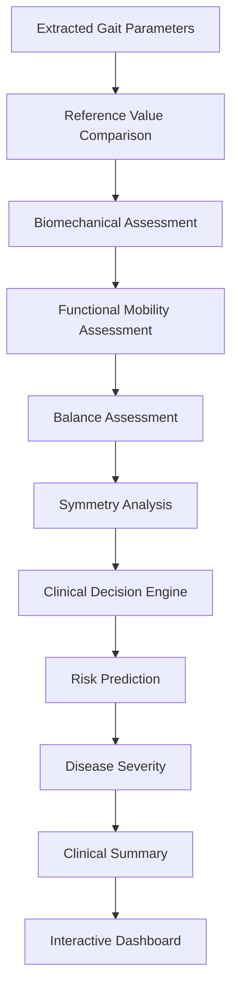

---

# 📊 Clinical Assessment Dashboard

The dashboard provides an intuitive hospital-style interface for reviewing quantitative gait measurements and AI-assisted clinical interpretations.

## Dashboard Components

### 🚶 Spatial Parameters

- Walking Speed
- Step Length
- Stride Length
- Step Width

---

### ⏱️ Temporal Parameters

- Cadence
- Step Time
- Stride Time
- Gait Cycle Duration
- Swing Phase
- Stance Phase
- Double Support Time
- Single Support Time

---

### ⚖️ Stability & Balance Metrics

- Walking Symmetry Index
- Arm Swing Symmetry
- Gait Stability Index
- Balance Score
- Turning Time
- Timed Up and Go (TUG)

---

### 🧠 Clinical Scores

- Overall Gait Health Score
- Parkinson's Risk Score
- Fall Risk Score
- Disease Severity Classification

---

# 🖥️ Dashboard Layout

```text
+-------------------------------------------------------------+
|            AI Clinical Gait Assessment Dashboard            |
+-------------------------------------------------------------+
| Walking Speed      | Cadence           | Step Length         |
|-------------------------------------------------------------|
| Stride Length      | Step Width        | Gait Cycle          |
|-------------------------------------------------------------|
| Swing Phase        | Stance Phase      | Double Support      |
|-------------------------------------------------------------|
| Balance Score      | Fall Risk         | Parkinson's Risk    |
|-------------------------------------------------------------|
| Overall Health     | Severity          | AI Summary          |
+-------------------------------------------------------------+
| Radar Chart | Bar Chart | Trend | Pie | Gauge | Line Graph   |
+-------------------------------------------------------------+
```

---

# 🌍 Clinical Reference Standards

To improve clinical relevance, the system compares measured gait parameters with reference values reported in internationally recognized gait analysis literature and rehabilitation guidelines.

Reference sources include:

- World Health Organization (WHO) rehabilitation guidance
- International Society of Biomechanics (ISB)
- Peer-reviewed gait analysis literature
- Parkinson's disease clinical assessment studies
- Rehabilitation engineering research

These comparisons help clinicians interpret deviations from expected healthy gait patterns.

---

# 📏 Example Healthy Adult Reference Values

| Parameter | Typical Healthy Adult Range* |
|-----------|------------------------------|
| Walking Speed | 1.2 – 1.4 m/s |
| Cadence | 100 – 120 steps/min |
| Step Length | 0.60 – 0.80 m |
| Stride Length | 1.20 – 1.60 m |
| Step Width | 7 – 10 cm |
| Gait Cycle Duration | ~1.0 – 1.2 s |
| Stance Phase | ~60% of gait cycle |
| Swing Phase | ~40% of gait cycle |
| Double Support Time | ~20–24% of gait cycle |

> *Values vary with age, sex, height, and walking conditions. These ranges are intended as reference values for comparison rather than definitive diagnostic thresholds.

---

# 📈 Clinical Comparison Engine

The comparison engine evaluates each measured parameter against reference values and identifies whether it falls within an expected range.

Possible outcomes include:

- ✅ Within expected range
- ⚠️ Mild deviation
- 🔶 Moderate deviation
- 🔴 Significant deviation

This information contributes to the overall clinical interpretation rather than acting as a standalone diagnosis.

---

# 🧩 Multi-Parameter Interpretation

The CDSS combines findings across multiple domains:

| Domain | Representative Metrics |
|--------|-------------------------|
| Spatial | Step Length, Stride Length, Step Width |
| Temporal | Cadence, Step Time, Stride Time |
| Symmetry | Arm Swing, Walking Symmetry Index |
| Stability | Gait Stability Index, Balance Score |
| Functional Mobility | TUG, Turning Time |
| Overall Assessment | Health Score, Risk Scores |

This holistic approach better reflects clinical gait evaluation practices.

---

# 📋 Example Clinical Interpretation

| Observation | Possible Clinical Interpretation |
|-------------|----------------------------------|
| Reduced walking speed | Functional mobility impairment |
| Shortened stride length | Hypokinetic gait characteristics |
| Increased double support time | Reduced balance confidence |
| Reduced arm swing | Upper-limb movement asymmetry |
| Increased TUG duration | Reduced functional mobility |
| Poor gait symmetry | Potential neurological involvement |

> These interpretations are provided for decision support and educational purposes. They should always be considered alongside comprehensive clinical assessment.

---

# 🧠 AI Clinical Summary

At the end of the analysis, the platform automatically generates a concise clinical summary synthesizing all measured parameters.

### Example

> **Clinical Summary:**  
> The analyzed gait demonstrates reduced walking speed, shortened stride length, mild asymmetry in arm swing, and prolonged double support time compared with reference values. Functional mobility appears mildly reduced based on the Timed Up and Go assessment. Overall findings suggest gait characteristics that warrant further neurological evaluation and continued clinical monitoring.

This summary is intended to improve readability and facilitate communication between clinicians, researchers, and students.

---

# 📊 Clinical Score Overview

| Score | Purpose |
|--------|---------|
| Overall Gait Health Score | Composite measure of gait quality |
| Balance Score | Estimates postural stability during walking |
| Fall Risk Score | Assesses factors associated with instability |
| Parkinson's Risk Score | AI-assisted estimation of Parkinsonian gait characteristics |

These scores are derived from multiple biomechanical features rather than a single measurement.

---

# 🏥 Intended Users

The Clinical Decision Support System is designed for:

- 👨‍⚕️ Neurologists
- 🧑‍⚕️ Physiotherapists
- 🩺 Rehabilitation Specialists
- 🏥 Hospitals and Clinics
- 🎓 Biomedical Engineering Students
- 🔬 Researchers in AI and Healthcare
- 🧪 Clinical Engineering Laboratories

---

# 🔍 Clinical Benefits

- Objective gait assessment
- Standardized reporting
- Reduced observer variability
- Quantitative rehabilitation monitoring
- Improved educational demonstrations
- Support for research and algorithm validation
- Enhanced visualization of gait characteristics

---

# ⚠️ Clinical Disclaimer

> This software is intended **for research, education, and clinical decision support**. It is **not a certified medical device** and should **not** be used as the sole basis for diagnosis or treatment decisions. All clinical interpretations must be confirmed by qualified healthcare professionals using comprehensive patient evaluation and established diagnostic procedures.

---

# 📏 Comprehensive Gait Parameters

The **AI-Based Gait Analysis System for Parkinson's Disease** extracts a comprehensive set of **spatiotemporal**, **kinematic**, and **clinical** gait parameters from the uploaded walking video. These measurements form the foundation of the Clinical Decision Support System (CDSS) and provide an objective assessment of an individual's walking performance.

The parameters are grouped into clinically meaningful categories to facilitate interpretation by clinicians, researchers, and rehabilitation professionals.

---

# 🚶 Spatial Gait Parameters

Spatial parameters describe the geometry and distance characteristics of walking.

| Parameter | Description | Clinical Significance |
|-----------|-------------|-----------------------|
| **Walking Speed** | Average forward velocity during walking (m/s) | Reduced speed is associated with Parkinson's disease, frailty, and impaired mobility. |
| **Step Length** | Distance between successive heel contacts of opposite feet | Shortened step length is common in Parkinsonian gait. |
| **Stride Length** | Distance between two consecutive heel strikes of the same foot | Indicates gait efficiency and locomotor function. |
| **Step Width** | Lateral distance between both feet | Wider step width may indicate compensatory balance strategies. |
| **Walking Path** | Estimated trajectory followed during walking | Deviations may indicate impaired balance or coordination. |

---

# ⏱️ Temporal Gait Parameters

Temporal parameters describe the timing characteristics of walking.

| Parameter | Description | Clinical Importance |
|-----------|-------------|--------------------|
| **Cadence** | Number of steps per minute | Reflects walking rhythm and efficiency. |
| **Step Time** | Duration of one step | Increased variability may indicate neurological impairment. |
| **Stride Time** | Time required for one complete stride | Useful for assessing gait regularity. |
| **Gait Cycle Duration** | Total duration of one gait cycle | Provides temporal characterization of locomotion. |
| **Walking Duration** | Total analyzed walking time | Used for normalization and trend analysis. |

---

# 🦵 Gait Phase Parameters

The AI estimates the duration of each major gait phase.

| Parameter | Description |
|-----------|-------------|
| **Stance Phase** | Time during which the foot remains in contact with the ground. |
| **Swing Phase** | Time during which the foot moves forward through the air. |
| **Double Support Time** | Period when both feet are simultaneously in contact with the ground. |
| **Single Support Time** | Period when only one foot supports body weight. |

These parameters provide insight into balance, coordination, and gait stability.

---

# ⚖️ Symmetry Parameters

Human gait is expected to be approximately symmetrical under healthy conditions.

The system evaluates symmetry using multiple metrics.

### Arm Swing Symmetry

Measures the similarity between left and right arm movements during walking.

Clinical relevance:

- Reduced arm swing is a hallmark of Parkinson's disease.
- Unilateral reduction may indicate early motor involvement.

---

### Walking Symmetry Index

Evaluates symmetry between left and right lower limbs.

The index considers:

- Step length
- Stride length
- Step timing
- Limb coordination

Higher asymmetry may indicate:

- Neurological disorders
- Musculoskeletal abnormalities
- Post-stroke gait
- Parkinsonian gait

---

# ⚖️ Stability Parameters

Maintaining stability during walking is essential for safe mobility.

The platform computes:

| Parameter | Purpose |
|-----------|----------|
| **Gait Stability Index** | Overall walking stability estimation |
| **Balance Score** | Functional balance assessment |
| **Turning Time** | Turning efficiency during walking tasks |
| **Timed Up and Go (TUG)** | Functional mobility evaluation |

---

# 🚨 Fall Risk Assessment

Falls are a major concern in Parkinson's disease and elderly populations.

The system estimates fall risk using multiple biomechanical indicators rather than relying on a single parameter.

## Factors Considered

- Walking speed
- Step length
- Stride length
- Double support time
- Balance score
- Gait stability
- Turning performance
- Walking symmetry
- TUG performance

### Example Risk Categories

| Fall Risk Score | Interpretation |
|-----------------|----------------|
| 0–25 | Low Risk |
| 26–50 | Mild Risk |
| 51–75 | Moderate Risk |
| 76–100 | High Risk |

> These categories are intended for research and decision-support purposes and should not replace formal clinical assessment.

---

# 🧠 Parkinson's Risk Prediction

One of the primary objectives of the platform is to estimate the likelihood of gait characteristics commonly associated with Parkinson's disease.

Unlike simple threshold-based methods, the AI evaluates **multiple gait features simultaneously**.

## Parameters Used

- Walking Speed
- Cadence
- Step Length
- Stride Length
- Step Width
- Swing Phase
- Stance Phase
- Double Support Time
- Arm Swing Symmetry
- Walking Symmetry Index
- Gait Stability Index
- Turning Time
- Timed Up and Go (TUG)
- Balance Score

These measurements are analyzed collectively to produce a **Parkinson's Risk Score**.

---

# 📊 Parkinson's Risk Score

The score is presented on a scale from **0 to 100**.

| Score | Clinical Interpretation |
|--------|-------------------------|
| **0–20** | Very Low Risk |
| **21–40** | Low Risk |
| **41–60** | Moderate Risk |
| **61–80** | High Risk |
| **81–100** | Very High Risk |

The score is intended to support clinical decision-making and should be interpreted alongside comprehensive neurological evaluation.

---

# 🏥 Disease Severity Classification

The system provides an AI-assisted severity classification based on the combined analysis of gait parameters.

### Example Classification

| Severity Level | Description |
|----------------|-------------|
| **Normal** | Gait parameters are largely within expected reference ranges. |
| **Mild** | Minor deviations with preserved functional mobility. |
| **Moderate** | Multiple gait abnormalities indicating functional impairment. |
| **Severe** | Significant gait dysfunction requiring further clinical evaluation. |

> These categories are illustrative and intended for educational and research purposes.

---

# 💚 Overall Gait Health Score

The **Overall Gait Health Score** summarizes the individual's walking performance into a single composite indicator.

The score incorporates:

- Spatial gait quality
- Temporal consistency
- Symmetry
- Stability
- Functional mobility
- Balance
- Clinical comparison with reference values

### Example Interpretation

| Score | Interpretation |
|--------|----------------|
| **90–100** | Excellent Gait Health |
| **75–89** | Good Gait Health |
| **60–74** | Fair Gait Health |
| **40–59** | Reduced Gait Health |
| **Below 40** | Significant Gait Impairment |

---

# ⚖️ Balance Assessment

Balance is estimated using multiple indicators rather than a single measurement.

The AI considers:

- Postural stability
- Step width
- Double support duration
- Turning performance
- Walking symmetry
- Gait stability index

The resulting **Balance Score** provides an overall estimate of functional balance during walking.

---

# 🧾 AI Clinical Summary Logic

After completing all analyses, the system automatically generates a concise clinical narrative summarizing the findings.

### Example

> **AI Clinical Summary:**  
> The analyzed gait demonstrates mildly reduced walking speed, shortened stride length, increased double support time, and moderate asymmetry in arm swing. Functional mobility remains preserved, although balance indicators suggest mild instability. Overall findings are consistent with gait abnormalities that warrant continued monitoring and further neurological assessment if clinically indicated.

The summary is intended to improve communication between clinicians, researchers, and patients by translating quantitative measurements into an interpretable overview.

---

# 📈 Parameter Interpretation Workflow

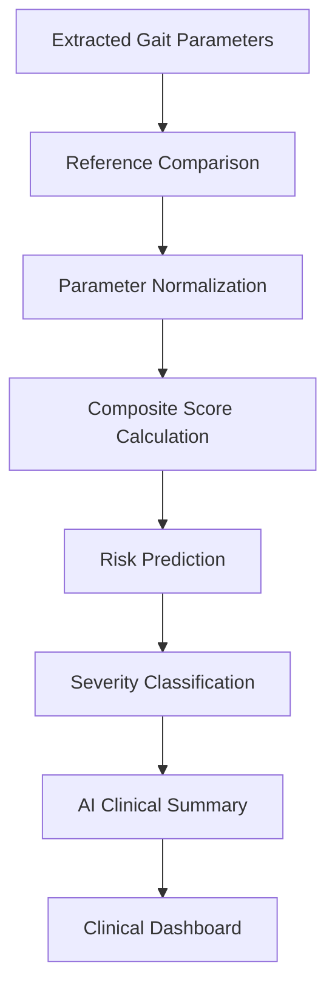

---

# 📋 Clinical Output Summary

Upon completion of the analysis, the system provides:

- ✅ Comprehensive gait parameter table
- ✅ Walking symmetry assessment
- ✅ Stability analysis
- ✅ Balance score
- ✅ Fall risk score
- ✅ Parkinson's risk score
- ✅ Disease severity classification
- ✅ Overall gait health score
- ✅ AI-generated clinical summary
- ✅ Interactive clinical visualizations
- ✅ Exportable clinical report (PDF, PNG, CSV, JSON)

---

# 📊 Interactive Data Visualization & Clinical Reporting

One of the key strengths of the **AI-Based Gait Analysis System for Parkinson's Disease** is its ability to transform complex biomechanical measurements into intuitive, interactive visualizations.

Instead of presenting clinicians with raw numerical values alone, the system provides a comprehensive **Clinical Gait Assessment Dashboard** featuring charts, gauges, trend analysis, and downloadable reports. This improves interpretability, supports clinical decision-making, and facilitates communication with patients and researchers.

---

# 🖥️ Interactive Clinical Dashboard

The dashboard is designed to resemble a modern hospital information system, providing a structured overview of gait analysis results.

## Dashboard Sections

- 📈 Patient Overview
- 🚶 Gait Parameter Summary
- 🧠 AI Clinical Summary
- ⚠️ Parkinson's Risk Prediction
- 🏥 Disease Severity Classification
- ⚖️ Balance Assessment
- 🚨 Fall Risk Assessment
- 📊 Interactive Charts
- 📄 Clinical Report Download

---

# 🎨 Dashboard Layout

```text
+----------------------------------------------------------------------------------+
|                    AI-Based Clinical Gait Assessment Dashboard                   |
+----------------------------------------------------------------------------------+
| Walking Speed | Cadence | Step Length | Stride Length | Step Width               |
+----------------------------------------------------------------------------------+
| Stance Phase | Swing Phase | Double Support | Single Support | Gait Cycle        |
+----------------------------------------------------------------------------------+
| Balance Score | Fall Risk | Parkinson's Risk | Severity Classification           |
+----------------------------------------------------------------------------------+
|                         AI Clinical Summary                                      |
+----------------------------------------------------------------------------------+
| Radar Chart | Bar Chart | Pie Chart | Gauge | Line Graph | Trend Analysis        |
+----------------------------------------------------------------------------------+
|                   Export Report (PDF | PNG | CSV | JSON)                         |
+----------------------------------------------------------------------------------+
```

---

# 📈 Radar Chart

The **Radar Chart** provides a multidimensional overview of key gait parameters relative to reference values.

### Displayed Metrics

- Walking Speed
- Cadence
- Step Length
- Stride Length
- Balance Score
- Walking Symmetry
- Gait Stability
- Arm Swing Symmetry

### Clinical Purpose

- Quickly identify abnormal gait domains
- Compare overall gait profile against healthy reference values
- Visualize strengths and deficiencies in a single view

---

# 📊 Bar Chart

The **Bar Chart** compares measured gait parameters with healthy adult reference ranges.

### Example

```text
Walking Speed     ██████████░░

Reference         ██████████████

Cadence           ███████████░░

Reference         █████████████
```

### Clinical Benefits

- Easy side-by-side comparison
- Highlights deviations
- Supports objective interpretation

---

# 🥧 Pie Chart

The **Pie Chart** summarizes the contribution of different gait assessment domains.

Example categories:

- Spatial Parameters
- Temporal Parameters
- Symmetry
- Stability
- Functional Mobility

This visualization provides a high-level overview of the assessment.

---

# 📉 Line Graph

The **Line Graph** displays parameter trends across time or multiple assessments.

Applications include:

- Rehabilitation progress monitoring
- Longitudinal patient follow-up
- Research studies
- Treatment outcome evaluation

Example tracked variables:

- Walking Speed
- Cadence
- Balance Score
- Parkinson's Risk Score
- Overall Gait Health Score

---

# 📈 Trend Analysis

Trend analysis enables clinicians to observe changes across repeated evaluations.

Typical trends include:

- Improvement following physiotherapy
- Decline in mobility
- Recovery after surgery
- Response to medication
- Disease progression

Example visualization:

```text
Walking Speed

1.40 ┤

1.30 ┤

1.20 ┤

1.10 ┤

1.00 ┤

0.90 ┤

0.80 ┤

0.70 ┼──────────────────────────────

      Visit1 Visit2 Visit3 Visit4
```

---

# 🎯 Gauge Charts

Gauge charts provide an intuitive representation of composite clinical scores.

### Displayed Scores

- Overall Gait Health Score
- Parkinson's Risk Score
- Balance Score
- Fall Risk Score

Example:

```text
Overall Gait Health

0 -----------50-----------100

███████████████████░░░░░░░░

             82
```

---

# 📋 Parameter Summary Table

The dashboard includes a comprehensive summary table.

| Parameter | Measured Value | Reference Range | Status |
|-----------|----------------|-----------------|--------|
| Walking Speed | 1.08 m/s | 1.2–1.4 m/s | ⚠️ Mildly Reduced |
| Cadence | 105 steps/min | 100–120 | ✅ Normal |
| Step Length | 0.58 m | 0.60–0.80 m | ⚠️ Slightly Reduced |
| Stride Length | 1.16 m | 1.20–1.60 m | ⚠️ Slightly Reduced |
| Balance Score | 84 | ≥80 | ✅ Good |
| Parkinson's Risk | 34 | — | Low Risk |

---

# 📄 Clinical Report Generation

Following completion of the analysis, the platform automatically generates a structured clinical report suitable for documentation, education, and research.

The report includes:

- Patient information (if provided)
- Analysis date
- Video metadata
- Measured gait parameters
- Clinical comparison
- AI-generated clinical summary
- Risk scores
- Disease severity classification
- Interactive charts
- Recommendations (optional)

---

# 📝 Example Report Structure

```text
Clinical Gait Assessment Report

Patient Information

Analysis Summary

Measured Gait Parameters

Reference Comparison

Clinical Interpretation

Overall Gait Health

Balance Assessment

Fall Risk Assessment

Parkinson's Risk Prediction

Disease Severity Classification

AI Clinical Summary

Charts & Graphs

Recommendations

End of Report
```

---

# 📦 Supported Export Formats

To support diverse workflows, reports can be exported in multiple formats.

| Format | Purpose |
|--------|---------|
| 📄 PDF | Clinical documentation and printing |
| 🖼️ PNG | Dashboard image sharing |
| 📊 CSV | Statistical analysis and spreadsheets |
| 📂 JSON | API integration and research datasets |

---

# 🔍 Clinical Visualization Advantages

The integrated visualization suite offers several benefits:

- Simplifies interpretation of complex gait metrics
- Supports communication between clinicians and patients
- Facilitates longitudinal monitoring
- Enhances educational demonstrations
- Improves presentation of research findings
- Enables quick identification of abnormal gait characteristics

---

# 🎨 User Experience Features

The dashboard is designed with usability in mind.

### Interface Features

- 🌙 Dark Theme
- ☀️ Light Theme
- 📱 Responsive Design
- 🖱️ Interactive Tooltips
- 📊 Dynamic Chart Updates
- 📄 One-Click Report Export
- ⚡ Smooth Animations
- 🏥 Hospital-Inspired Layout

---

# 📈 Visualization Workflow

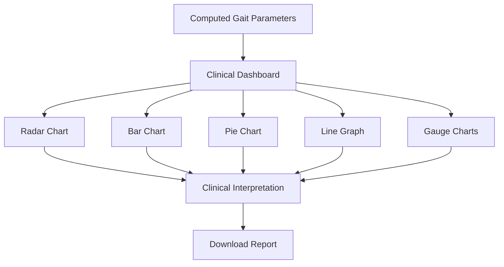

---

# 💡 Why Visualization Matters

Clinical gait analysis generates numerous quantitative measurements. Visual representations enable users to identify trends, detect abnormalities, and compare results more effectively than numerical tables alone.

By combining interactive charts with AI-generated summaries, the platform enhances transparency, interpretability, and usability for clinicians, researchers, educators, and students.

---

# 💻 Technology Stack

The **AI-Based Gait Analysis System for Parkinson's Disease** is built using a modern software stack that combines Artificial Intelligence, Computer Vision, Biomedical Signal Processing, and Responsive Web Technologies.

The architecture has been designed to be modular, scalable, and suitable for future clinical research applications.

---

# 🧠 Artificial Intelligence & Computer Vision

| Technology | Purpose |
|------------|---------|
| **Python** | Core programming language |
| **OpenCV** | Video processing and image manipulation |
| **MediaPipe Pose** | Human pose estimation and landmark detection |
| **NumPy** | Numerical computations |
| **SciPy** | Scientific and biomechanical calculations |
| **Pandas** | Data processing and report generation |

---

# 🌐 Web Technologies

| Technology | Purpose |
|------------|---------|
| **Flask** | Backend web framework |
| **HTML5** | Web page structure |
| **CSS3** | User interface styling |
| **JavaScript (ES6)** | Client-side interactivity |
| **Bootstrap 5** | Responsive layout and components |

---

# 📊 Visualization Libraries

| Library | Purpose |
|----------|---------|
| **Chart.js** | Interactive charts and graphs |
| **Plotly** *(optional)* | Advanced analytical visualizations |
| **Matplotlib** | Report graphics generation |

---

# 📄 Report Generation

The application supports multiple export formats for research, documentation, and clinical review.

Supported outputs:

- 📄 PDF
- 🖼️ PNG
- 📊 CSV
- 📂 JSON

---

# ⚙️ Software Requirements

## Minimum Requirements

| Component | Requirement |
|-----------|-------------|
| Operating System | Windows 10+, Ubuntu 22.04+, macOS 12+ |
| Python | 3.10 or newer |
| RAM | 8 GB |
| Storage | 2 GB free |
| Processor | Intel Core i5 (or equivalent) |
| Browser | Chrome, Edge, Firefox, Safari |

---

## Recommended Requirements

| Component | Recommendation |
|-----------|----------------|
| RAM | 16 GB or higher |
| CPU | Intel Core i7 / AMD Ryzen 7 |
| GPU | Optional (CUDA-compatible for future AI models) |
| Storage | SSD |
| Internet | Required for deployment (optional for local use) |

---

# 📂 Project Structure

```text
AI-Based-Gait-Analysis-System/
│
├── app.py
├── requirements.txt
├── README.md
├── LICENSE
│
├── static/
│   ├── css/
│   ├── js/
│   ├── images/
│   ├── icons/
│   └── uploads/
│
├── templates/
│   ├── index.html
│   ├── dashboard.html
│   ├── report.html
│   └── components/
│
├── models/
│   ├── gait_analysis.py
│   ├── pose_estimation.py
│   ├── clinical_engine.py
│   ├── prediction.py
│   └── severity_classifier.py
│
├── services/
│   ├── video_processor.py
│   ├── biomechanics.py
│   ├── landmark_tracking.py
│   ├── gait_cycles.py
│   └── report_generator.py
│
├── utils/
│   ├── calculations.py
│   ├── validators.py
│   ├── helpers.py
│   └── constants.py
│
├── exports/
│
├── docs/
│
├── datasets/
│
└── tests/
```

---

# ⚡ Installation Guide

## 1️⃣ Clone the Repository

```bash
git clone https://github.com/yourusername/AI-Based-Gait-Analysis-System.git

cd AI-Based-Gait-Analysis-System
```

---

## 2️⃣ Create a Virtual Environment

### Windows

```bash
python -m venv venv

venv\Scripts\activate
```

### Linux / macOS

```bash
python3 -m venv venv

source venv/bin/activate
```

---

## 3️⃣ Install Dependencies

```bash
pip install -r requirements.txt
```

---

## 4️⃣ Verify Installation

```bash
python --version

pip list
```

---

## 5️⃣ Run the Application

```bash
python app.py
```

The application will typically be available at:

```
http://127.0.0.1:5000
```

---

# 📋 Example `requirements.txt`

```text
Flask
opencv-python
mediapipe
numpy
pandas
scipy
matplotlib
plotly
chartjs
reportlab
```

> Add version numbers based on your final tested environment for reproducibility.

---

# 🚀 Usage Instructions

## Step 1 — Launch the Application

Start the Flask server and open the web interface in your browser.

---

## Step 2 — Upload a Walking Video

Upload a supported video file showing the subject walking under recommended recording conditions.

---

## Step 3 — AI Processing

The system automatically performs:

- Video preprocessing
- Pose estimation
- Landmark tracking
- Gait cycle detection
- Biomechanical analysis
- Clinical parameter extraction
- Risk prediction

Users will only see upload and analysis progress indicators.

---

## Step 4 — Review Results

After processing, the dashboard displays:

- Spatial gait parameters
- Temporal gait parameters
- Balance score
- Fall risk score
- Parkinson's risk score
- Disease severity classification
- AI-generated clinical summary
- Interactive visualizations

---

## Step 5 — Export Report

Choose one of the supported formats:

- PDF
- PNG
- CSV
- JSON

The generated report can be saved for documentation, education, or research.

---

# 📡 API Structure (Example)

The project can be extended with RESTful APIs to enable integration with external applications.

## Upload Video

```http
POST /api/upload
```

### Request

```json
{
  "video": "walking_video.mp4"
}
```

### Response

```json
{
  "status": "uploaded",
  "analysis_id": "12345"
}
```

---

## Start Analysis

```http
POST /api/analyze
```

### Response

```json
{
  "status": "processing",
  "progress": 45
}
```

---

## Get Analysis Result

```http
GET /api/result/{analysis_id}
```

### Example Response

```json
{
  "walking_speed": 1.18,
  "cadence": 108,
  "step_length": 0.66,
  "stride_length": 1.32,
  "balance_score": 86,
  "fall_risk": 22,
  "parkinsons_risk": 31,
  "severity": "Mild"
}
```

---

## Download Report

```http
GET /api/report/{analysis_id}
```

### Supported Formats

- PDF
- PNG
- CSV
- JSON

---

# ⚙️ Configuration

Example environment variables:

```env
FLASK_APP=app.py
FLASK_ENV=development
SECRET_KEY=your_secret_key
UPLOAD_FOLDER=static/uploads
MAX_CONTENT_LENGTH=500MB
```

---

# 🔧 Development Workflow

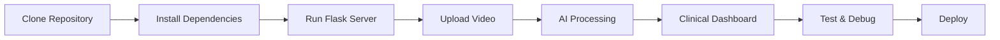

---

# ☁️ Deployment Options

The application can be deployed on:

- Local Computer
- University Laboratory Systems
- Hospital Research Servers
- Docker Containers
- Cloud Virtual Machines
- AWS EC2
- Microsoft Azure
- Google Cloud Platform
- Render
- Railway

---

# 🧪 Testing Recommendations

Before deployment, validate:

- Video upload functionality
- Pose estimation accuracy
- Gait parameter consistency
- Dashboard responsiveness
- Report generation
- Export functionality
- API responses
- Cross-browser compatibility

---

# 🛠️ Maintenance & Extensibility

The modular architecture allows future enhancements, including:

- Integration with Electronic Health Records (EHR)
- Multi-camera gait analysis
- Real-time webcam analysis
- Deep learning classification models
- Mobile application support
- Cloud-based processing
- Additional neurological disorder modules

---

# 📸 Application Screenshots

> **Note:** Replace the placeholders below with screenshots from your completed project.

---

## 🏠 Home Page


**Highlights**

- Modern biomedical-inspired UI
- Responsive layout
- Dark & Light themes
- Project overview
- Secure video upload interface

---

## 🎥 Video Upload Page


Features:

- Drag & Drop Upload
- Upload Progress
- File Validation
- Supported Format Display
- Video Preview

---

## 🤖 AI Processing Screen


Displays:

- Upload Progress
- AI Analysis Progress
- Estimated Processing Status
- Secure Background Processing

---

## 📊 Clinical Dashboard


Dashboard Components:

- Clinical Summary
- Gait Parameters
- Parkinson's Risk
- Disease Severity
- Balance Assessment
- Fall Risk
- Interactive Charts

---

## 📈 Interactive Charts


Charts Include:

- Radar Chart
- Bar Chart
- Pie Chart
- Line Graph
- Gauge Charts
- Trend Analysis

---

## 📄 Generated Clinical Report


Report Includes:

- Patient Information
- Clinical Summary
- Gait Parameters
- AI Interpretation
- Graphs
- Download Options

---

# 📑 Sample Clinical Report

Below is an example of the report generated by the platform.

---

## Patient Information

| Field | Value |
|--------|--------|
| Patient ID | Demo-001 |
| Age | 65 Years |
| Gender | Male |
| Test Date | YYYY-MM-DD |
| Analysis Mode | Normal Walking Test |

---

## Measured Parameters

| Parameter | Measured Value | Reference Range | Status |
|-----------|---------------|-----------------|--------|
| Walking Speed | 1.08 m/s | 1.20–1.40 m/s | ⚠️ Mildly Reduced |
| Cadence | 106 steps/min | 100–120 | ✅ Normal |
| Step Length | 0.59 m | 0.60–0.80 m | ⚠️ Slightly Reduced |
| Stride Length | 1.18 m | 1.20–1.60 m | ⚠️ Slightly Reduced |
| Step Width | 8 cm | 7–10 cm | ✅ Normal |
| Double Support | 25% | 20–24% | ⚠️ Slightly Increased |

---

## AI Clinical Assessment

| Assessment | Result |
|------------|--------|
| Overall Gait Health | 82 / 100 |
| Balance Score | 84 / 100 |
| Fall Risk | Low |
| Parkinson's Risk | Low–Moderate |
| Disease Severity | Mild |

---

## AI Clinical Summary

> **Clinical Interpretation:**  
> The analysis demonstrates mildly reduced walking speed and stride length with slight prolongation of double support time. Arm swing and walking symmetry remain within acceptable limits. Functional mobility is preserved, although subtle gait deviations suggest the need for periodic monitoring. These findings should be interpreted alongside clinical examination and patient history.

---

# 📊 Performance Metrics

The effectiveness of the system should be evaluated using both technical and clinical performance indicators.

---

## AI Performance Metrics

| Metric | Description |
|---------|-------------|
| Pose Detection Accuracy | Accuracy of body landmark localization |
| Landmark Tracking Stability | Consistency across video frames |
| Processing Time | Time required for complete analysis |
| Video Throughput | Number of frames processed per second |
| Parameter Extraction Reliability | Repeatability of gait measurements |

---

## Clinical Performance Metrics

| Metric | Purpose |
|---------|----------|
| Gait Parameter Agreement | Comparison with validated gait analysis systems |
| Clinical Consistency | Agreement with expert clinical assessment |
| Intra-Test Repeatability | Consistency across repeated trials |
| Inter-Test Reliability | Stability across sessions |
| Decision Support Accuracy | Agreement of AI recommendations with expert interpretation |

---

# 🔬 Validation Strategy

To establish confidence in the system, the following validation approach is recommended.

### Technical Validation

- Landmark detection accuracy
- Frame processing performance
- Robustness to different video qualities
- Cross-platform testing

---

### Clinical Validation

Compare system outputs with:

- Clinical gait assessments
- Instrumented gait laboratories
- Physiotherapist evaluations
- Neurologist observations
- Published normative gait datasets

---

### Statistical Validation

Potential statistical methods include:

- Pearson Correlation
- Intraclass Correlation Coefficient (ICC)
- Bland–Altman Analysis
- Root Mean Square Error (RMSE)
- Mean Absolute Error (MAE)

---

# 🧪 Research Applications

This platform can support a wide range of academic and scientific investigations.

### Biomedical Engineering

- AI-assisted gait analysis
- Human motion analysis
- Medical device prototyping
- Rehabilitation engineering

---

### Artificial Intelligence

- Pose estimation research
- Clinical computer vision
- Explainable AI
- Human movement analytics

---

### Clinical Research

- Parkinson's disease studies
- Rehabilitation monitoring
- Fall risk prediction
- Mobility assessment
- Functional outcome evaluation

---

### Education

Suitable for:

- Biomedical Engineering projects
- AI in Healthcare coursework
- Computer Vision demonstrations
- Clinical Engineering laboratories
- Research methodology training

---

# 🏥 Clinical Applications

Potential applications include:

## Neurology

- Parkinson's disease assessment
- Movement disorder evaluation
- Longitudinal monitoring

---

## Physiotherapy

- Rehabilitation progress tracking
- Functional mobility assessment
- Outcome measurement

---

## Orthopedics

- Post-operative gait evaluation
- Lower-limb rehabilitation
- Recovery monitoring

---

## Geriatrics

- Mobility screening
- Balance evaluation
- Fall prevention programs

---

## Sports Science *(Future Extension)*

- Athletic gait analysis
- Running biomechanics
- Performance optimization

---

# ⚠️ Current Limitations

Although the system demonstrates strong potential as a clinical decision-support tool, several limitations should be acknowledged.

### Technical Limitations

- Performance depends on video quality.
- Severe occlusions may reduce landmark accuracy.
- Camera positioning influences measurement precision.
- Extreme lighting conditions may affect pose estimation.
- Current implementation assumes a single visible subject.

---

### Clinical Limitations

- Not a replacement for neurological examination.
- Not intended for definitive diagnosis.
- Requires further validation with large clinical datasets.
- Normative values may vary by age, sex, and population.
- Clinical interpretation should always involve qualified healthcare professionals.

---

# 🚀 Opportunities for Future Validation

Future work may include:

- Multi-center clinical studies
- Larger participant cohorts
- Comparison with optical motion capture systems
- Wearable sensor fusion
- Prospective rehabilitation trials
- Regulatory evaluation for clinical deployment

---

# 🏆 Project Highlights

- ✅ AI-powered markerless gait analysis
- ✅ Biomedical Engineering final-year project
- ✅ Clinical Decision Support System (CDSS)
- ✅ Hospital-style dashboard
- ✅ Multi-parameter gait assessment
- ✅ Parkinson's risk estimation
- ✅ Disease severity classification
- ✅ Interactive visualizations
- ✅ Multi-format report export
- ✅ Modular and scalable architecture
- ✅ Suitable for research, education, and future clinical development

---

# 📈 Impact

The project demonstrates how **Artificial Intelligence**, **Computer Vision**, and **Biomedical Engineering** can be combined to create accessible gait assessment tools that support research, rehabilitation, and clinical decision-making while reducing reliance on expensive motion analysis laboratories.

---

# 🚀 Future Scope

The current implementation provides a strong foundation for AI-assisted gait assessment. Future development will focus on improving clinical accuracy, expanding functionality, and enabling real-world healthcare integration.

---

## 🧠 Artificial Intelligence Enhancements

Future versions may include:

- Deep Learning-based Parkinson's Disease classification
- Transformer-based temporal gait analysis
- Graph Neural Networks (GNNs) for skeletal motion modeling
- Explainable AI (XAI) for transparent clinical predictions
- Federated Learning for privacy-preserving model training
- Self-supervised learning using unlabeled gait datasets

---

## 📹 Computer Vision Improvements

Potential enhancements include:

- Multi-camera gait reconstruction
- 3D pose estimation
- Depth-camera support
- Stereo vision integration
- Real-time webcam analysis
- Occlusion-aware landmark tracking
- Improved robustness under challenging lighting conditions

---

## 🏥 Clinical Enhancements

Future clinical capabilities may include:

- Unified Parkinson's Disease Rating Scale (UPDRS)-informed assessment
- Hoehn & Yahr stage assistance
- Freezing of Gait (FoG) detection
- Tremor and bradykinesia analysis
- Dyskinesia monitoring
- Longitudinal patient tracking
- Personalized rehabilitation recommendations

---

## 📱 Digital Health Integration

Future integration opportunities include:

- Mobile applications (Android & iOS)
- Telemedicine platforms
- Electronic Health Records (EHR)
- Hospital Information Systems (HIS)
- Cloud-based clinical dashboards
- Remote rehabilitation monitoring
- Secure clinician portals

---

## ⌚ Wearable Integration

The architecture supports future fusion with wearable technologies such as:

- Smartwatches
- Inertial Measurement Units (IMUs)
- Pressure-sensitive insoles
- Force sensors
- EMG systems
- Smart rehabilitation devices

---

# 🔬 Research Opportunities

The platform provides a flexible foundation for future research in:

- AI-assisted neurological assessment
- Computer vision in healthcare
- Biomedical signal processing
- Explainable medical AI
- Human movement analysis
- Rehabilitation engineering
- Digital biomarkers
- Clinical decision support systems

---

# 🌍 Potential Impact

This project aims to contribute to the broader goals of digital healthcare by:

- Improving accessibility to gait assessment
- Supporting objective clinical evaluation
- Reducing dependence on expensive gait laboratories
- Facilitating early identification of gait abnormalities
- Enabling data-driven rehabilitation monitoring
- Promoting AI adoption in biomedical engineering

---

# 📚 References

The methodologies and clinical concepts presented in this project are informed by internationally recognized guidelines and peer-reviewed literature.

## International Organizations

1. **World Health Organization (WHO)** – Rehabilitation and Healthy Ageing Resources.
2. **International Society of Biomechanics (ISB)** – Standards for human movement analysis.
3. **Movement Disorder Society (MDS)** – Clinical guidance on Parkinson's Disease assessment.

---

## Clinical & Scientific Literature

- Perry, J., & Burnfield, J. M. *Gait Analysis: Normal and Pathological Function.*
- Whittle, M. W. *Gait Analysis: An Introduction.*
- Winter, D. A. *Biomechanics and Motor Control of Human Movement.*
- Hausdorff, J. M. et al. Publications on gait variability in Parkinson's disease.
- Morris, M. E. Research on gait impairments and rehabilitation in Parkinson's disease.

> Replace these with the exact editions, journal articles, and DOIs used during your project to ensure accurate citation.

---

# 📄 License

This project is released under the **MIT License**.

```text
MIT License

Copyright (c) 2026

Permission is hereby granted, free of charge, to any person obtaining a copy
of this software and associated documentation files, to deal in the Software
without restriction, including without limitation the rights to use, copy,
modify, merge, publish, distribute, sublicense, and/or sell copies of the
Software, subject to the conditions of the MIT License.

THE SOFTWARE IS PROVIDED "AS IS", WITHOUT WARRANTY OF ANY KIND.
```

For the complete license text, see the `LICENSE` file in this repository.

---

# 📖 Citation

If you use this project in academic work, research, or publications, please cite it appropriately.

```bibtex
@software{AI_Gait_Analysis_2026,
  title   = {AI-Based Gait Analysis System for Parkinson's Disease},
  author  = {Your Name},
  year    = {2026},
  version = {1.0},
  url     = {https://github.com/yourusername/AI-Based-Gait-Analysis-System}
}
```

---

# 🙏 Acknowledgements

This project was developed as a **Biomedical Engineering Final Year Project**.

Special acknowledgement is extended to:

- Faculty mentors and project supervisors
- Biomedical Engineering department
- Open-source software communities
- MediaPipe development team
- OpenCV contributors
- Flask community
- Researchers in gait analysis, biomechanics, rehabilitation engineering, and Parkinson's disease

Their work has provided valuable foundations for advancing accessible, AI-assisted clinical technologies.

---

# 👨‍💻 Author

**Your Name**

Biomedical Engineering Student

Final Year Project

### Areas of Interest

- Artificial Intelligence in Healthcare
- Biomedical Signal Processing
- Computer Vision
- Medical Image Analysis
- Clinical Decision Support Systems
- Rehabilitation Engineering
- Digital Health Technologies

---

# 📬 Contact

Update these details before publishing.

- 📧 Email: your.email@example.com
- 💼 LinkedIn: https://linkedin.com/in/yourprofile
- 🐙 GitHub: https://github.com/yourusername
- 🌐 Portfolio: https://yourportfolio.com *(optional)*

---

# ⭐ Contributing

Contributions are welcome for educational and research purposes.

To contribute:

1. Fork the repository.
2. Create a new feature branch.
3. Commit your changes with clear messages.
4. Submit a Pull Request describing the proposed improvements.

Please ensure that contributions maintain code quality, documentation standards, and ethical AI practices.

---

# ⚠️ Disclaimer

This software is intended **for research, education, and clinical decision support only**.

It is **not** a certified medical device and should **not** be used as the sole basis for diagnosis, treatment, or medical decision-making. Clinical interpretation should always be performed by qualified healthcare professionals in conjunction with patient history, physical examination, and established diagnostic procedures.

---

# 🌟 Support the Project

If you found this project helpful:

- ⭐ Star this repository
- 🍴 Fork the project
- 🧠 Share ideas through Issues or Discussions
- 🤝 Contribute improvements via Pull Requests

Your support helps improve AI-driven biomedical engineering research and encourages the development of accessible healthcare technologies.

---

<div align="center">

# 🎉 Project Complete

## **AI-Based Gait Analysis System for Parkinson's Disease**

**A Research-Oriented Clinical Decision Support Platform Combining Artificial Intelligence, Computer Vision, and Biomechanical Analysis**

---

**Developed as a Biomedical Engineering Final Year Project**

*Advancing accessible, objective, and intelligent gait assessment through modern AI technologies.*

⭐ **Thank you for visiting this repository!**

</div>

